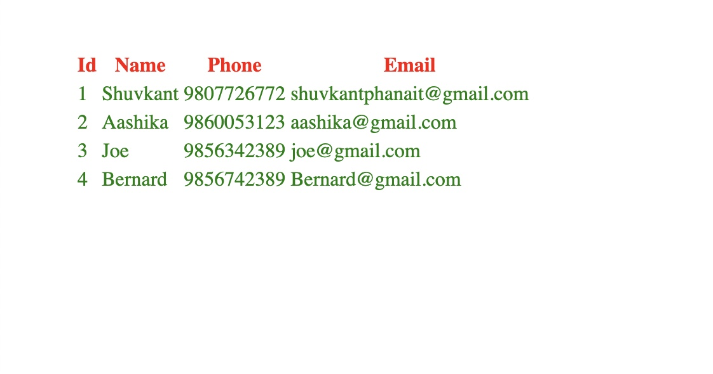
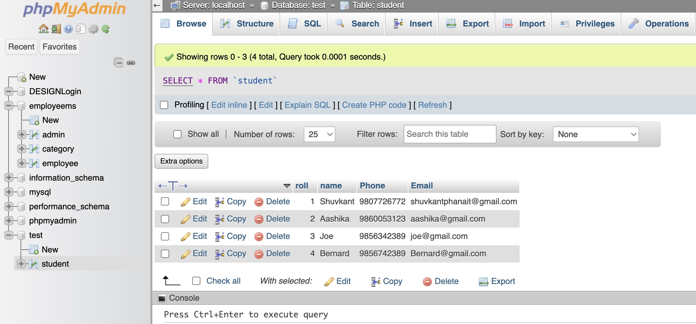

# Integrate_MysqlREact

#### I have made this in the process of learning to integrate the data from the MySql database to the react app.

`I have created a database named 'test' within which there is the file named student. The file student consists of four fields`

1. Roll
2. Name
3. Phone
4. Email

## Screenshot

### mySql

